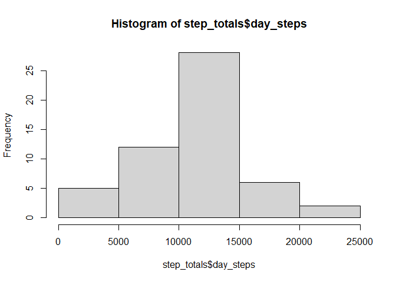
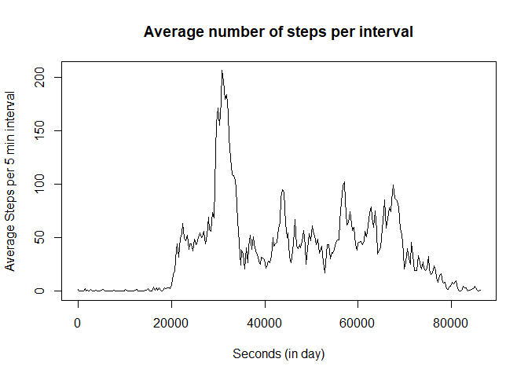
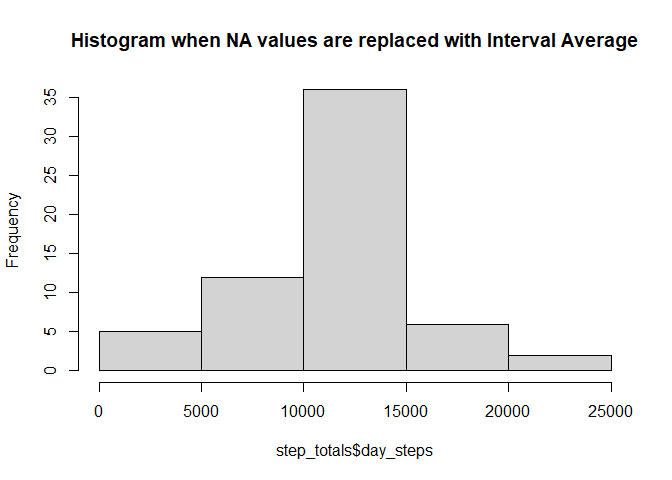
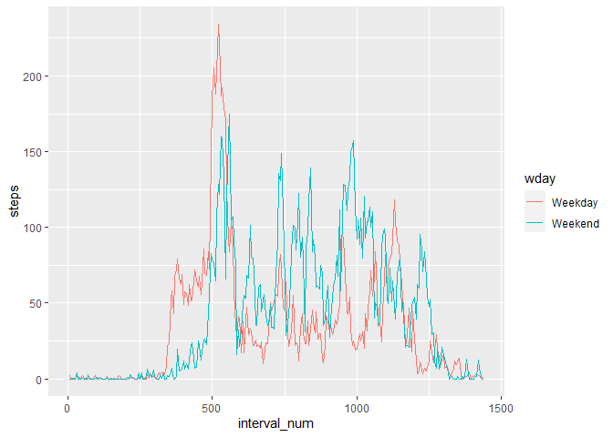

First, some libraries:

```r
library(dplyr)
library(lubridate)
library(stringr)
library(ggplot2)
```
Now, here is the code to load the csv into a df, data:

```r
setwd("~/R/R_scripts/Reproducible_research/Week2/RepData_PeerAssessment1")
if (!file.exists("./activity.csv")){
        ziploc<-"./activity.zip"
        unzip(ziploc)
}
        fileloc<-"./activity.csv"
        data<-read.csv(fileloc)  
```
Preprocess data:

```r
data <- data %>%
        mutate(interval=str_pad(interval, 4, pad="0")) %>%
        mutate(interval=paste(substr(interval, 1, 2),
                              substr(interval, 3, 4), sep=":")) %>%
        mutate(interval=hm(interval))
```

## What is mean total number of steps taken per day?

Find the total number of steps per day:

```r
step_totals<-data %>%
        group_by(date) %>%
        summarise(day_steps=sum(steps, na.rm=TRUE)) %>%
        filter(day_steps>0) 
```

```
## `summarise()` ungrouping output (override with `.groups` argument)
```

```r
hist(step_totals$day_steps)
```

<!-- -->

```r
dat_mean=mean(step_totals$day_steps)
dat_median=median(step_totals$day_steps)
```

The mean total number of steps taken per day is 1.0766189\times 10^{4}  
The median total number of steps per day is 10765


## What is the average daily activity pattern?
Use dplyr to calculate average for each interval:

```r
avg_steps_interval<-data %>%
        group_by(interval) %>%
        summarise(interval_steps=mean(steps, na.rm=TRUE))
```

```
## `summarise()` ungrouping output (override with `.groups` argument)
```

Plot the average daily activity:

```r
plot(avg_steps_interval$interval, avg_steps_interval$interval_steps, 
     type="l", main="Average number of steps per interval", 
     xlab="Seconds (in day)", ylab="Average Steps per 5 min interval")
```

<!-- -->


```r
max_steps<-max(avg_steps_interval$interval_steps)
max_index<-avg_steps_interval[avg_steps_interval$interval_steps==max_steps,1]
```
The interval with the max steps is 8H 35M 0S, when on average 206.1698113 are taken.  


## Imputing missing values
Calculate the total number of NA values in the dataset:

```r
total_na<-sum(is.na(data$steps))
```
There are 2304 NA values for "steps" in the dataset  

Use dplyr to join the avg steps dataset with the original. Then, use dplyr's mutate function to replace any NA's with the average value for that interval:


```r
data_fill_nas <- left_join(data, avg_steps_interval, 
                           by = c("interval" = "interval"))
data_fill_nas<- data_fill_nas %>%
        mutate(steps= case_when(is.na(steps)==TRUE~interval_steps,
                                TRUE ~ as.numeric(steps))) %>%
        select(steps, date, interval)
```

Now, recalculate the mean and median with the NA's filled in:

```r
step_totals<-data_fill_nas %>%
        group_by(date) %>%
        summarise(day_steps=sum(steps, na.rm=TRUE)) %>%
        filter(day_steps>0) 
```

```
## `summarise()` ungrouping output (override with `.groups` argument)
```

```r
hist(step_totals$day_steps, main="Histogram when NA values are replaced with Interval Average")
```

<!-- -->

```r
dat_mean_filled=mean(step_totals$day_steps)
dat_median_filled=median(step_totals$day_steps)
```

The mean total number of steps taken per day (with NAs filled in) is 1.0766189\times 10^{4}. Previously, without NAs filled in, the mean was 1.0766189\times 10^{4}  
The median total number of steps per day (with NAs filled in) is 1.0766189\times 10^{4}. Previously, without NAs filled in, the median was 10765  
Adding in the missing values did not have a major impact on the data - the mean is the same. The median was bumped up slightly. This is expected, as the NA's were ignored in the previous calculation; replacing those NA's with average values should not adjust the overall shape of the data

## Are there differences in activity patterns between weekdays and weekends?


Update dataset with weekend column

```r
avg_wday <- data %>%
    mutate(wday=weekdays(strptime(date, format="%Y-%m-%d"))) %>%
    mutate(wday=case_when(wday=="Saturday" | 
                            wday=="Sunday" ~ "Weekend",
                          TRUE ~ "Weekday"
                          )) %>%
    group_by(wday, interval) %>%
    summarise(steps=mean(steps, na.rm=TRUE))%>%
    mutate(interval_num=(1:288)*5)
```

```
## `summarise()` regrouping output by 'wday' (override with `.groups` argument)
```

Now plot weekends vs weekdays with ggplot:  

```r
g<-ggplot(avg_wday, aes(interval_num, steps, color=wday))
g+geom_line()
```

<!-- -->
  
Clearly, the step patterns for people changes based on whether is is a weekday or a weekend. On weekdays (red), there are major spikes in steps early and late in the day. On weekends, steps start later, are spread all throughout the day, and end later.  

###That is it!
